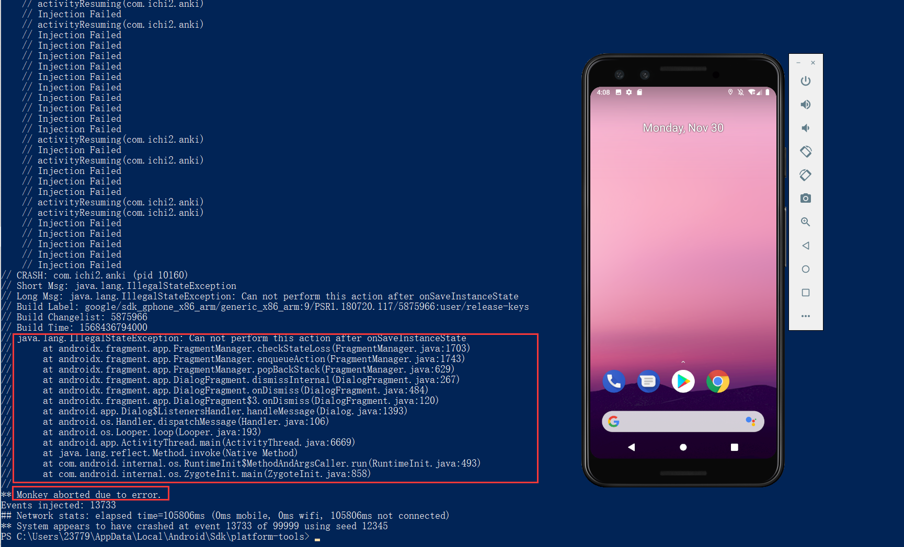

# README

Name: 孙挺

Student ID: 11710108

### - Run monkey on you selected app using one seed (s=0)  

### - See if it finds any crash  

No.

### - Run monkey on using another seed (s=12345)  

### - Increase the event count if no crash found  

An error was found when the seed is 12345 and the event count was added to 99999.

