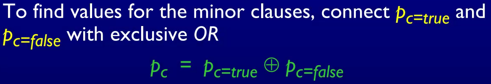

#### 概念

- Fault、Error、Failure的区别（真题）

<br>

#### JUnit4

- 要点
  - 方法的返回值是void
  - 方法的可见性是public
  - 方法前要加注解 @Test
  - assertEquals等方法中要将正确的值放在前面，如：`assertEquals (0, s.size ());`

- 测试 System.out.println() 的方法

  - ```java
    @Test
    public void testAIsFalseAndBIsFalseAndCIsFalse() {
        ByteArrayOutputStream os = new ByteArrayOutputStream();
        PrintStream ps = new PrintStream(os);
        System.setOut(ps);
        // execute statement to be tested, e.g.: CheckIt.checkIt(false, false, false);
        System.setOut(originalOut);
        assertEquals("P isn't true" + System.getProperty("line.separator"), os.toString());
    }
    ```

- 测试异常值的方法

  - 方法一：将异常的值放到注解中

    - ```java
      @Test(expected = FileNotFoundException.class)
      public void testReadFile() throws IOException {
          FileReader reader = new FileReader("test.txt");
          reader.read();
          reader.close();
      }
      ```

  - 方法二：把try...catch当成if...else来用，甚至可以嵌套使用

<br>

#### 测试驱动开发 (TDD)

- 先写一个当前无法通过的测试
- 跑所有的测试然后看这个新的测试fail
- 修改源码
- 跑通所有测试
- 重构代码，移除冗余

<br>

#### Input Space Partitioning（ISP）/Input Domain Modeling（IDM）

- 将input domain划分为多种情况的方法
  - Interface-based
    - 单纯根据所要测试的函数的参数的数据类型，来找到合适的测试输入
    - 如：对于一个 int 型的数据，可以把它的输入域分成三种：<0, =0, >0
  - Functionality-based
    - 理解函数的细节，根据函数参数在函数中的具体用途来找到合适的测试输入
    - 如：如果有一个函数是用来判断输入三角形的类型的，那么我们测试它时就可以输入不同的三角形

- IDM覆盖标准
  - All combinations：对所有可能性进行排列组合
  - each choice coverage：每一个输入的每一种可能的情况都至少要出现在一个测试中
  - Pair-wise coverage：每一个输入的每一种情况都要和另一个输入的每一种情况在某一个测试中共同出现
  - base choice coverage：先从每一个输入中各挑一种情况作为base choice，然后每次改变一个输入，遍历这个输入的所有可能的情况

<br>

#### Graph

- **TR：test requirements，所有的测试**
- 概念辨析
  - graph：主要指control flow graph
    - 
  - edge：出现判断
  - node：除了判断以外的逻辑
  - loop：for、while循环
- data flow的定义
  - def：变量被赋值（包括初始化和后续赋值）
  - use：变量被使用了（即相应的内存被访问了）
    - P-use：变量被用在predicate中来做判断了。如：x>y中的x
    - C-use：变量被用来做数值计算了。如：y=x+7中的x
  - definition-use path (du-path)：这个变量从def node到use node的path
  - definition-clear path (dc-path)：这个变量没有在这个du-path中间被赋值，只在path开始的那个node被赋值 
- graph覆盖标准
  - node coverage：测试路径覆盖了所有的node
  - edge coverage：测试路径覆盖了所有的edge
  - edge pair coverage：TR包含了graph中所有两两相邻的edge
  - complete path coverage：TR包含了graph中所有的path

<br>

#### Logic

- predicate可以包含多个clause，clause就是没有逻辑连接符的predicate
- predicate coverage：对于程序中的每一个predicate，TR中都包含了这个predicate为true、false的测试
- clause coverage：对于程序中的每一个clause，TR中都包含了这个clause为true、false的测试
- clause coverage的覆盖标准
  - 在一个predicate中，选择一个clause为major clause，其他的全是minor clause 
    - **General active clause coverage**：对这个predicate的测试中，不同测试的minor clause不必相同，并且可能会无法做到predicate coverage
    - **Restricted active clause coverage**：对这个predicate的测试中，不同测试的minor clause必须相同，并且当major clause的值改变时，整个predicate的值也会改变
      - 满足RACC的方式
        - 
    - **Correlated active clause coverage**：对这个predicate的测试中，当major clause的值改变时，整个predicate的值也会改变，这两个测试中，minor clause的值可以不相同

<br>

#### Syntax

- RIPR 模型
  - Reachability：能到达变异的语句那里
  - Infection：变异的语句在测试时，导致程序出现了错误的状态
  - propagation：错误的状态导致了错误的输出
  - Revealability：测试人员必须观察部分的错误输出
- Weakly Killing Mutants：当且仅当我们的测试在经过变异的地方后状态发生了改变
  - 满足 reachability 和 infection, 但不满足 propagation
- Strongly Killing Mutants: 我们的测试结果和变异前的不一样了
- Mutation Coverage：对于每一个mutant，TR中都恰好含有一个requirement能够kill它
- Weak Mutation Coverage：对于每一个mutant，TR中都恰好含有一个requirement能weakly kill它

<br>

#### Automated debugging

- Statistical Fault Localization
  - 根据统计，给程序中的所有语句出现bug的可能性排序

- Dynamic Slicing
  - 追踪最后出错的地方受到哪些地方影响，如：它的值的来源，它是怎么进入这个值所在block的...
  - 但是这样的话在大型程序中受影响的地方太多了，可能很难分析得过来
- Delta debugging
  - 在debug时，通过二分法逐步确定bug所在的地方

- Symbolic execution
  - 累加要进入程序各个分支时面临的所有约束，最后得出总条件
  - 普通的测试一次只能测试一种状态，而符号执行一次可以分析所有的状态
- fuzzer  
  - Mutation-based fuzzer  
    - 不需要知道domain knowledge，但是面对checksum、protocol等严格检查时容易fail
  - Generation-based fuzzers  
    - 需要知道domain knowledge，测试的性能由所写规格的质量决定，但是可以通过严格检查
- Program Synthesis
  - 原理：用户通过简单的描述性的语言定义所需的内容，编译器基于搜索找到相应的内容
  - 例子：FlashFill、Sketch、SQLizer  


