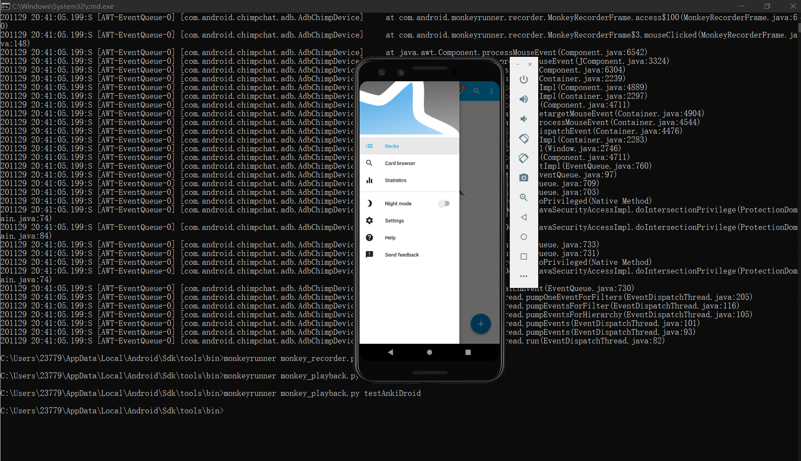

# Group members

**武羿 (11712738)**: [AntennaPod](https://github.com/AntennaPod/AntennaPod/tree/develop) 

**徐天元 (11710208)**: [Kontalk](https://github.com/kontalk/androidclient)

**孙挺 (11710108)**: [AnkiDroid](https://github.com/ankidroid/Anki-Android)

- **Q1-Q3**
    - Answers from 徐天元
    - Answers from 孙挺
    - Answers from 武羿
- **Q4**
    - Answer form Group Discussion


# Answers from 徐天元

### Question1

**In “mp2-part2”, you have chosen a method for performing input space modeling. This question encourages you to think about constructing JUnit test cases at the GUI level.**

**a) Add the selected method in the README.md by quoting the source code.**

Selected method: 

https://github.com/kontalk/androidclient/blob/master/app/src/main/java/org/kontalk/ui/AbstractComposeFragment.java line 520 - 600

```java
 @Override
    public boolean onActionItemClicked(ActionMode mode, MenuItem item) {
        switch (item.getItemId()) {
            case R.id.menu_delete: {
                // using clone because listview returns its original copy
                deleteSelectedMessages(DataUtils
                    .cloneSparseBooleanArray(getListView().getCheckedItemPositions()));
                mode.finish();
                return true;
            }

            case R.id.menu_reply: {
                CompositeMessage msg = getCheckedItem();
                replyMessage(msg);
                mode.finish();
                return true;
            }

            case R.id.menu_retry: {
                CompositeMessage msg = getCheckedItem();
                retryMessage(msg);
                mode.finish();
                return true;
            }

            case R.id.menu_share: {
                CompositeMessage msg = getCheckedItem();
                shareMessage(msg);
                mode.finish();
                return true;
            }

            case R.id.menu_copy_text: {
                if (mCheckedItemCount == 1) {
                    CompositeMessage msg = getCheckedItem();
                    copyMessage(msg);
                }
                else {
                    copySelectedMessages(getListView().getCheckedItemPositions());
                }
                mode.finish();
                return true;
            }

            case R.id.menu_open: {
                CompositeMessage msg = getCheckedItem();
                openFile(msg);
                mode.finish();
                return true;
            }

            case R.id.menu_download: {
                CompositeMessage msg = getCheckedItem();
                mWaitingDownload = msg.getDatabaseId();
                startDownload(msg);
                mode.finish();
                return true;
            }

            case R.id.menu_cancel_download: {
                CompositeMessage msg = getCheckedItem();
                stopDownload(msg);
                mode.finish();
                return true;
            }

            case R.id.menu_details: {
                CompositeMessage msg = getCheckedItem();
                showMessageDetails(msg);
                mode.finish();
                return true;
            }

            case R.id.menu_save_attachment: {
                CompositeMessage msg = getCheckedItem();
                saveAttachments(msg);
                mode.finish();
                return true;
            }
        }
        return false;
    }
```

**b) Construct test cases that fulfilled Each Choice Coverage at the GUI level (If your JUnit test cases couldn’t be constructed at the GUI level, explain the reason. For example, if there is no button/option to enter a negative value at the GUI level, then this JUnit test case is infeasible at the GUI level.). These test cases can be either hand-written (e.g., “Edit Text field with username=ccs409”->”Edit Text field with password=12345”->“Click button Login”. ) or record-and-replay using MonkeyRunner/Espresso.**

"Long press a message item" -> "press delete button" -> "press OK button"  

"Long press a message item" -> "press reply button" -> "input text" -> "press sent message"

"Long press a message item" -> "press retry button"

"Long press a message item" -> "press menu button" -> "press share button" 

"Long press a message item" -> "press menu button" -> "press copy text" -> "paste text"

"Long press a message item" -> "press menu button" -> "press detail"


### Question2

**Draw the event flow graph (a simplified definition of event-flow graph is given as below) of your selected app. Event-flow Graphs (EFG): Each node in an EFG captures a specific user interaction (e.g. touching a button on smartphone screen), whereas an edge in the EFG captures a possible transition between two user interactions. If your EFG is too complicated (with more than 100 nodes), draw a partial EFG that captures the important events from the main screens. (4 points)**


**a) Construct 2 test cases by traversin (clicking-through) your EFG. These test cases can be either hand-written (e.g., “Edit Text field with username=ccs409”->”Edit Text field with password=12345”->“Click button Login”. ) or record-and-replay using MonkeyRunner/Espresso. (4 points)**


test case one:

"Long press a message item" -> "press delete button" -> "Long press a message item" -> "press reply button" -> "input text" -> "press sent message" -> "Long press a message item" -> "press retry button" "Long press a message item" -> "press menu button" -> "press share button" -> "Long press a message item" -> "press menu button" -> "press copy text" -> "paste text" ->"Long press a message item" -> "press menu button" -> "press detail"

test case two:

"Long press a message item" -> "press menu button" -> "press detail" -> "Long press a message item" -> "press menu button" -> "press copy text" -> "paste text" -> "Long press a message item" -> "press delete button" -> "Long press a message item" -> "press reply button" -> "input text" -> "press sent message" -> "Long press a message item" -> "press retry button" "Long press a message item" -> "press menu button" -> "press share button" -> "Long press a message item" -> "press menu button" -> "press copy text"


### Question3

**In “logic-sourcecode-lab”, you have selected a method with at least two clauses in your selected app where you write JUnit tests for fulfilling various logic coverage criteria.**

**a) Add the selected method in the README.md by quoting the source code.**

Selected method: 

https://github.com/kontalk/androidclient/blob/master/app/src/main/java/org/kontalk/ui/AbstractComposeFragment.java line 1079-1148

```java
public void onListItemClick(ListView listView, View view, int position, long id) {
    MessageListItem item = (MessageListItem) view;
    final CompositeMessage msg = item.getMessage();

    AttachmentComponent attachment = msg.getComponent(AttachmentComponent.class);

    LocationComponent location = msg.getComponent(LocationComponent.class);

    if (attachment != null && (attachment.getFetchUrl() != null || attachment.getLocalUri() != null)) {

        // outgoing message or already fetched
        if (attachment.getLocalUri() != null) {
            // open file
            openFile(msg);
        }
        else {
            // info & download dialog
            CharSequence message = MessageUtils
                .getFileInfoMessage(getActivity(), msg, getDecodedPeer(msg));

            MaterialDialog.Builder builder = new MaterialDialog.Builder(getActivity())
                .title(R.string.title_file_info)
                .content(message)
                .negativeText(android.R.string.cancel)
                .cancelable(true);

            if (!DownloadService.isQueued(attachment.getFetchUrl())) {
                MaterialDialog.SingleButtonCallback startDL = new MaterialDialog.SingleButtonCallback() {
                    @Override
                    public void onClick(@NonNull MaterialDialog dialog, @NonNull DialogAction which) {
                        // start file download
                        startDownload(msg);
                    }
                };
                builder.positiveText(R.string.download)
                    .onPositive(startDL);
            }
            else {
                MaterialDialog.SingleButtonCallback stopDL = new MaterialDialog.SingleButtonCallback() {
                    @Override
                    public void onClick(@NonNull MaterialDialog dialog, @NonNull DialogAction which) {
                        // cancel file download
                        stopDownload(msg);
                    }
                };
                builder.positiveText(R.string.download_cancel)
                    .onPositive(stopDL);
            }

            builder.show();
        }
    }

    else if (location != null) {
        String userId = item.getMessage().getSender();
        if (item.getMessage().getSender() == null)
            userId = Kontalk.get().getDefaultAccount().getSelfJID();

        Intent intent = new Intent(getActivity(), PositionActivity.class);
        Position p = new Position(location.getLatitude(), location.getLongitude(),
            "", "");
        intent.putExtra(PositionActivity.EXTRA_USERPOSITION, p);
        intent.putExtra(PositionActivity.EXTRA_USERID, userId);
        startActivity(intent);
    }

    else {
        item.onClick();
    }
}
```

**(b) Construct 2 test cases at the GUI level to fulfill predicate coverage criteria. These test cases can be either hand-written (e.g., “Edit Text field with username=ccs409”->”Edit Text field with password=12345”->“Click button Login”. ) or record-and-replay using MonkeyRunner/Espresso. (4 points)**

Make 

attachment != null && (attachment.getFetchUrl() != null || attachment.getLocalUri() != null) is true

1. "click a local file" -> open the file
2. "clicked an external file" -> download the file from the url
3. "clicked an external file" -> "click the cancel button" -> cancel file downloading

Make

attachment != null && (attachment.getFetchUrl() != null || attachment.getLocalUri() != null) is false

1. "click a user"
2. "click a message"
3. "click a button"


# Answers From 孙挺

### Question 1

#### selected method

> ```java
> static String[] splitTags(String tags) {
>     if (tags == null) {
>         return null;
>     }
>     return tags.trim().split("\\s+");
> }
> ```

This JUnit test for this method cannot be constructed in GUI level. Reasons: it's a util method and thus there is no directly user input for this method.

#### JUnit test: 

- **Parameters**: tags

- Identify the characteristic according to Interface-based Input Domain Modeling

  - **Characteristic**  

    - tags is null
    - tags is empty
    - tags's length > 0
    
  - **Test Input**
  
    - tags = null
    - tags = ""
    - tags = "aa bb"
  
  - **JUnit Test**

    - We use JUnit5 for convenience
  
    - ```java
      class UtilsTest {
          private Duration duration;
          
          void testSplitTags() {
              String str=null;
              assertNull(Utils.splitTags(str));
              assertArrayEquals({""}, Utils.splitTags(""));
              assertArrayEquals({"aa", "bb"}, Utils.splitTags("aa bb"));
        }
      }
      ```
    
    
  
- Identify the characteristic according to Functionality-based Input Domain Modeling  

  - **Characteristic**  

    - tags has no tag
    - tags has 1 tag
    - tags has more than 1 tags
    
  - **Test Input**
  
    - tags = "      "
    - tags = "aa"
    - tags = "aa bb cc"
  
  - **JUnit Test**

    - We use JUnit5 for convenience
  
    - ```java
      class UtilsTest {
          private Duration duration;
          
          void testSplitTags() { 
              assertArrayEquals({""}, Utils.splitTags("      "));
              assertArrayEquals({"aa"}, Utils.splitTags("aa"));
              assertArrayEquals({"aa", "bb", "cc"}, Utils.splitTags("aa bb cc"));
        }
      }
      ```


### Question 2

#### Draw the event flow graph of your selected app  


#### Construct 2 test cases by traversing (clicking-through) your EFG  

- I traverse the EFG by record-and-replay using MonkeyRunner.

- Screenshot for record:

  

- Screenshot for replay:

  

- Script:

  > TOUCH|{'x':958,'y':1858,'type':'downAndUp',}
  > TOUCH|{'x':958,'y':1858,'type':'downAndUp',}
  > TOUCH|{'x':81,'y':58,'type':'downAndUp',}
  > TOUCH|{'x':283,'y':760,'type':'downAndUp',}
  > TOUCH|{'x':91,'y':72,'type':'downAndUp',}
  > TOUCH|{'x':307,'y':1084,'type':'downAndUp',}
  > TOUCH|{'x':77,'y':112,'type':'downAndUp',}
  > TOUCH|{'x':81,'y':81,'type':'downAndUp',}
  > TOUCH|{'x':266,'y':1098,'type':'downAndUp',}
  > TOUCH|{'x':50,'y':144,'type':'downAndUp',}
  > TOUCH|{'x':74,'y':49,'type':'downAndUp',}
  > TOUCH|{'x':259,'y':1215,'type':'downAndUp',}
  > TOUCH|{'x':74,'y':90,'type':'downAndUp',}
  > TOUCH|{'x':185,'y':495,'type':'downAndUp',}
  > TOUCH|{'x':874,'y':49,'type':'downAndUp',}
  > TOUCH|{'x':756,'y':580,'type':'downAndUp',}
  > TOUCH|{'x':30,'y':1381,'type':'downAndUp',}

### Question 3

#### Add the selected method in the README.md by quoting the source code  

- selected method:

> ```java
>     private final MaterialDialog.ListCallback mContextMenuListener = (materialDialog, view, item, charSequence) -> {
>         switch (view.getId()) {
>             case CONTEXT_MENU_DELETE_DECK:
>                 Timber.i("Delete deck selected");
>                 ((DeckPicker) getActivity()).confirmDeckDeletion();
>                 break;
> 
>             case CONTEXT_MENU_DECK_OPTIONS:
>                 Timber.i("Open deck options selected");
>                 ((DeckPicker) getActivity()).showContextMenuDeckOptions();
>                 ((AnkiActivity) getActivity()).dismissAllDialogFragments();
>                 break;
>             case CONTEXT_MENU_CUSTOM_STUDY: {
>                 Timber.i("Custom study option selected");
>                 long did = getArguments().getLong("did");
>                 CustomStudyDialog d = CustomStudyDialog.newInstance(
>                         CustomStudyDialog.CONTEXT_MENU_STANDARD, did);
>                 ((AnkiActivity) getActivity()).showDialogFragment(d);
>                 break;
>             }
>             case CONTEXT_MENU_RENAME_DECK:
>                 Timber.i("Rename deck selected");
>                 ((DeckPicker) getActivity()).renameDeckDialog();
>                 break;
> 
>             case CONTEXT_MENU_EXPORT_DECK:
>                 Timber.i("Export deck selected");
>                 ((DeckPicker) getActivity()).showContextMenuExportDialog();
>                 break;
> 
>             case CONTEXT_MENU_UNBURY: {
>                 Timber.i("Unbury deck selected");
>                 Collection col = CollectionHelper.getInstance().getCol(getContext());
>                 col.getSched().unburyCardsForDeck(getArguments().getLong("did"));
>                 ((StudyOptionsFragment.StudyOptionsListener) getActivity()).onRequireDeckListUpdate();
>                 ((AnkiActivity) getActivity()).dismissAllDialogFragments();
>                 break;
>             }
>             case CONTEXT_MENU_CUSTOM_STUDY_REBUILD: {
>                 Timber.i("Empty deck selected");
>                 ((DeckPicker) getActivity()).rebuildFiltered();
>                 ((AnkiActivity) getActivity()).dismissAllDialogFragments();
>                 break;
>             }
>             case CONTEXT_MENU_CUSTOM_STUDY_EMPTY: {
>                 Timber.i("Empty deck selected");
>                 ((DeckPicker) getActivity()).emptyFiltered();
>                 ((AnkiActivity) getActivity()).dismissAllDialogFragments();
>                 break;
>             }
>             case CONTEXT_MENU_CREATE_SUBDECK: {
>                 Timber.i("Create Subdeck selected");
>                 ((DeckPicker) getActivity()).createSubdeckDialog();
>                 break;
>             }
>         }
>     };
> ```

#### Construct 2 test cases at the GUI level to fulfill predicate coverage criteria  

- To fulfill predicate coverage criteria, I constructed 2 tests using MonkeyRunner  

- **Test1**

  - Screenshot

    

  - Script

    - > TOUCH|{'x':931,'y':1881,'type':'downAndUp',}
      > TOUCH|{'x':931,'y':1881,'type':'downAndUp',}
      > TOUCH|{'x':921,'y':1692,'type':'downAndUp',}
      > TOUCH|{'x':70,'y':72,'type':'downAndUp',}
      > TOUCH|{'x':945,'y':1885,'type':'downAndUp',}
      > TOUCH|{'x':945,'y':1822,'type':'downAndUp',}

- **Test2**
  - Screenshot

    

  - Script
  
    - > TOUCH|{'x':87,'y':144,'type':'downAndUp',}
      > TOUCH|{'x':87,'y':144,'type':'downAndUp',}
      > TOUCH|{'x':870,'y':1129,'type':'downAndUp',}
      > TOUCH|{'x':884,'y':139,'type':'downAndUp',}
      > TOUCH|{'x':70,'y':139,'type':'downAndUp',}
      > TOUCH|{'x':1012,'y':126,'type':'downAndUp',}
      > TOUCH|{'x':87,'y':526,'type':'downAndUp',}
      > TOUCH|{'x':756,'y':121,'type':'downAndUp',}
      > TOUCH|{'x':398,'y':396,'type':'downAndUp',}


# Answers from 武羿
Name: 武羿
ID: 11712738
### 1. In “mp2-part2”, you have chosen a method for performing input space modeling. This question encourages you to think about constructing JUnit test cases at the GUI level.

#### a) Add the selected method in the README.md by quoting the source code. 

```java
de.danoeh.antennapod.core.util;
import java.util.Locale;

/** Provides methods for converting various units. */
public final class Converter {
  
  ....

   /**
     * Converts short duration string (XX:YY) to milliseconds. If durationIsInHours is true then the
     * format is HH:MM, otherwise it's MM:SS.
     */
    public static int durationStringShortToMs(String input, boolean durationIsInHours) {
        String[] parts = input.split(":");
        if (parts.length != 2) {
            return 0;
        }

        int modifier = durationIsInHours ? 60 : 1;

        return Integer.parseInt(parts[0]) * 60 * 1000 * modifier
                + Integer.parseInt(parts[1]) * 1000 * modifier;
    }
    ...
}
```


#### b) Construct test cases that fulfilled Each Choice Coverage at the GUI level (If your JUnit test cases couldn’t be constructed at the GUI level, explain the reason. For example, if there is no button/option to enter a negative value at the GUI level, then this JUnit test case is infeasible at the GUI level.). These test cases can be either hand-written (e.g., “Edit Text field with username=ccs409”->”Edit Text field with password=12345”->“Click button Login”. ) or record-and-replay using MonkeyRunner/Espresso.

This test cannot be tested at the GUI level. Because this is an internal method used in processing raw podcast documents to check time information. We users are not able to get involed in it.

### 2. Draw the event flow graph (a simplified definition of event-flow graph is given as below) of your selected app. Event-flow Graphs (EFG): Each node in an EFG captures a specific user interaction (e.g. touching a button on smartphone screen), whereas an edge in the EFG captures a possible transition between two user interactions. If your EFG is too complicated (with more than 100 nodes), draw a partial EFG that captures the important events from the main screens. (4 points)
#### a) Construct 2 test cases by traversin (clicking-through) your EFG. These test cases can be either hand-written (e.g., “Edit Text field with username=ccs409”->”Edit Text field with password=12345”->“Click button Login”. ) or record-and-replay using MonkeyRunner/Espresso. (4 points)

As the app is complex, I only draw the partial EFG.


- Test 1: Open Main Screen => Click one podcast image => Click subscribe button => Click the "open podcast" button to enter the podcast display interface => Click one audio to open it => Click the download button to download the audio 

- Test 2: Open Main Screen => Search podcasts by entering keywords, such as "english news"=>  Click one podcast image => Click subscribe button => Click the "open podcast" button to enter the podcast display interface => Click one audio to open it => Click play button to play the audio => Click pause button to pause the audio

### 3. In “logic-sourcecode-lab”, you have selected a method with at least two clauses in your selected app where you write JUnit tests for fulfilling various logic coverage criteria. 

#### a) Add the selected method in the README.md by quoting the source code. 


```java

   private void toggleQueueLock() {
        boolean isLocked = UserPreferences.isQueueLocked();
        if (isLocked) {
            setQueueLocked(false);
        } else {
            boolean shouldShowLockWarning = prefs.getBoolean(PREF_SHOW_LOCK_WARNING, true);
            if (!shouldShowLockWarning) {
                setQueueLocked(true);
            } else {
                AlertDialog.Builder builder = new AlertDialog.Builder(getContext());
                builder.setTitle(R.string.lock_queue);
                builder.setMessage(R.string.queue_lock_warning);

                View view = View.inflate(getContext(), R.layout.checkbox_do_not_show_again, null);
                CheckBox checkDoNotShowAgain = view.findViewById(R.id.checkbox_do_not_show_again);
                builder.setView(view);

                builder.setPositiveButton(R.string.lock_queue, (dialog, which) -> {
                    prefs.edit().putBoolean(PREF_SHOW_LOCK_WARNING, !checkDoNotShowAgain.isChecked()).apply();
                    setQueueLocked(true);
                });
                builder.setNegativeButton(R.string.cancel_label, null);
                builder.show();
            }
        }
    }

```

#### b) Construct 2 test cases at the GUI level to fulfill predicate coverage criteria. These test cases can be either hand-written (e.g., “Edit Text field with username=ccs409”->”Edit Text field with password=12345”->“Click button Login”. ) or record-and-replay using MonkeyRunner/Espresso. (4 points)

Predicate: 
(1) isLocked
(2) !shouldShowLockWarning

- Test 1 : `isLocked` true:

    - Open Playlists (default state :unlock) => Click the Lock Button => Click “lock playlist” in the popup dialog to lock the playlist => Click the Lock Button again to unlock => End

- Test 2:  `isLocked` false and `!shouldShowLockWarning` false :
    - Open Playlists (default state :unlock) => Click the Lock Button => Click “lock playlist” button in the popup dialog to lock the playlist => End


- Test 3:  `isLocked` false and `!shouldShowLockWarning` true :
    - Open Playlists (default state :unlock) => Click the Lock Button => select “Don't show again” and click “lock playlist” in the popup dialog => Click the Lock Button to unlock => Click the Lock Button and no dialog pops up => End


# Q4
### 4. Compare the three methods (input domain modeling, graph coverage, and logic coverage) of constructing test cases by answering the following questions. You should discuss this question with your teammate after completing question 1-3. 
#### a) Which method is the most useful in finding new bugs? Why? (2 points)

Logic coverage.  After our group disscussion, we think logic coverage is the most useful in finding new bugs. For input domain modeling, we construct different inputs but they may not cover different branches. For logic coverage, we need to consider specific functions and events to trigger different branches in a method, which can have more chances to reveal bugs. For graph coverage, it tranverse the event at coarser level than logic coverage, thus could missing some details that lead to a bug.

#### b) Comparing input domain modeling and logic coverage, which method is the most effective in constructing test cases at the GUI level? (2 points)

Logic coverage. When constructing test cases for logic coverage, we need to think about how to trigger different GUI event to cover different predicates and branches. But for input dimain modeling, we focus on the input set which is at a finer level than GUI level.
