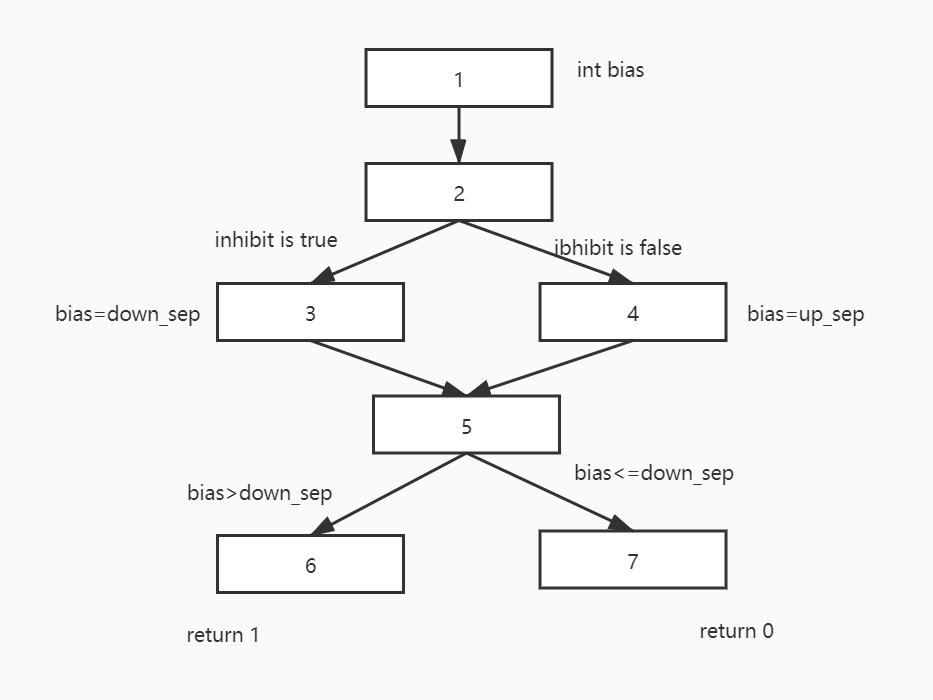

## README

**Name: Sun Ting（孙挺）**

**Student ID: 11710108**

### Extended Exercise 1

**Step 1: Draw this graph**  

**Step 2: If possible, list test-paths that achieve Node Coverage, but not Edge Coverage, explain why not?**  

- No. Reason:
  - Node 1 has no input edge, so it must be the begin node.
  - Node 4 has no output edge, so it must be the end node.
  - edge that from node 2 to node 3 and that from node 3 to node 2 share the nodes, and node 3 has no other edge.
  - Therefore, the only path to traverse all nodes is {1, 2, 3, 2, 4}, which covers all edges.

**Step 3: If possible, list test-paths that achieve Edge Coverage, but not Edge-Pair Coverage, explain why not?**  

- Yes. Reason:
  - If we choose {1, 2, 3, 2, 4} as our path, we can achieve Edge Coverage as my last answer described, but not Edge-Pair Coverage as {1, 2, 4} is not covered. 

**Step 4: List test paths that achieve Edge-Pair Coverage**  

- {{1, 2, 3, 2, 4}, {1, 2, 4}}

- Compare:

### Extended Exercise 2

**Step 1: Draw this graph**  

**Step 2: List the test requirements for Edge-Pair Coverage. (Hint: You should get 12 requirements)**  

- {1, 2, 3}, {1, 2, 4}, {1, 7}, {2, 3, 2}, {2, 4, 5}, {2, 4, 6}, {3, 2, 4}, {4, 5, 6}, {4, 6, 1}, {5, 6, 1}, {6, 1, 7}, {6, 1, 2}

**Step 3: Does these test paths satisfy Edge-Pair Coverage? If not, state what is missing?**  

- NO. {6, 1, 2} is missing.

**Step 4: Consider the simple path [3, 2, 4, 5, 6] & test path [1, 2, 3, 2, 4, 6, 1, 2, 4, 5, 6, 1, 7]. Does the test path tour the simple path directly? With a sidetrip? If so, write down the sidetrip.**  

- Sidetrip: {5, 6}

**Step 5: List the test requirements for Node Coverage, Edge Coverage, and Prime Path Coverage.**   

- Node Coverage Requirement: {1, 2, 3, 4, 5, 6, 7}
- Edge Coverage Requirement: (1, 2),(1, 7),(2, 3),(2, 4),(3, 2),(4, 5),(4, 6),(5, 6),(6,1)
- Prime Path Coverage Requirement: {1,2,4,6,1}, {1,2,4,5,6,1}, {2,4,5,6,1,2}, {2,4,6,1,2}, {2,3,2}, {3,2,4,5,6,1,7}, {3,2,4,6,1,7}, {3,2,3}, {4,5,6,1,2,4}, {4,5,6,1,2,3}, {4,6,1,2,3}, {4,6,1,2,4}, {5,6,1,2,4,5}, {6,1,2,4,5,6}, {6,1,2,4,6}

**Step 6: List test paths from the given set that achieve Node Coverage but not Edge Coverage.**  

- p3: {1, 2, 3, 2, 4, 5, 6, 1, 7} 

**Step 7: List test paths from the given set that achieve Edge Coverage but not Prime Path Coverage on the graph.**  

- [1, 2, 4, 5, 6, 1, 7] , [1, 2, 3, 2, 4, 6, 1, 7]

### Data Flow Analysis Exercise  

**Draw the data flow graph for the variable “bias” for the “Lab: Data flow example”**  

**Write down All-defs for “bias”**  

def(bias)={1, 3, 4}

**Write down All-uses for “bias”**  

use(bias)={edge 5 to 6, edge 5 to 7}

**Write down All-du-paths for “bias”**  

du_path(bias)={1,2,3,5}, {1,2,4,5}

